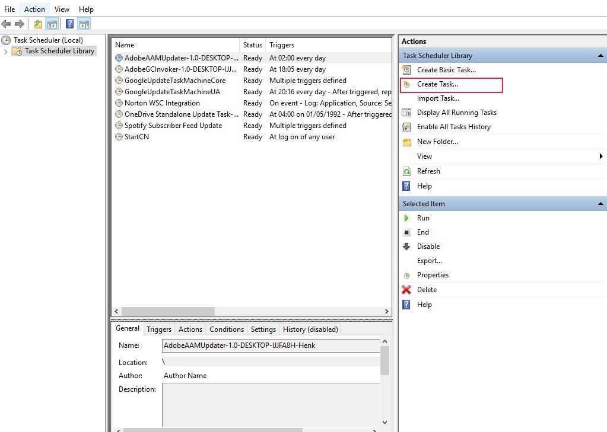
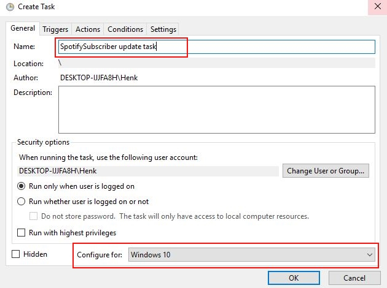
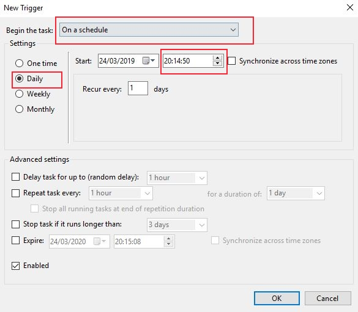
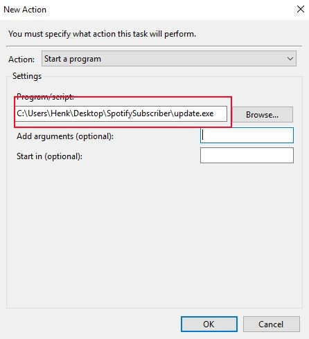

# Description
[WORK IN PROGRESS]

Spotify subscription feed tool. Allows you to subscribe to Spotify playlists, and creates a subscription feed playlist. Whenever any of the subscribed playlists changes, the new songs are added to the subscription feed.

The program can be either run from source using Python, or independently using a set of Windows executables (no additional installations required). See the sections below for instructions.

NOTE: There is no GUI yet, so all actions have to be performed using the command line. For the less technical users, detailed descriptions on how to do this have been provided in the next section. If you are familiar with Python, it is probably most convenient to just download and execute the source code directly. Instructions to do so are provided in the section [Running from source](#source_code).

This tool is in a very early stage, and all contributions are very welcome. Feel free to submit a pull request if you think something can be improved.

# Instructions
## <a name="windows_executables"></a> Using the Windows executables
NOTE: Setting up automatic updates currently involves quite some manual labor. I hope to have the program do this automatically in the future.

### Downloading the tool and creating a subscription playlist
- Download [the zip file](https://github.com/jneeven/SpotifySubscriber/raw/master/SpotifySubscriber.zip) and extract it to the location you want to install the tool to.
- Open the extracted SpotifySubscriber folder.
- Hold shift and press right click on an empty space in the folder, you should see the option `"Open PowerShell window here"`:


Click this option, and in the window that appears, type the following command:
```bash
.\init.exe USERNAME
```
Where USERNAME should be replaced by your own username, in my case `jneeven`.
It should look something like this:

This will open your browser and Spotify will ask you to login and give permission for this tool to read and modify your playlists, etc. After you give permission, you will be redirected to http://localhost/?code=SOME_CODE. **Do not close the browser window! Instead, copy the URL from the browser and enter it in the PowerShell window.**

If everything was successful, you should see the following message:
```
Creating playlist with name SpotifySubscriber and the following description:
SpotifySubscriber feed. Whenever one of your subscribed playlists changes, the new songs are added to this list.
Successfully initialized SpotifySubscriber for username jneeven. To get started, subscribe to a few playlists with subscribe.py and then periodically run update.py.
```

If you now open Spotify, you will see that a new playlist was added to your account:


This is the playlist to which all new tracks from your subscribed playlists will be added.

### Subscribe/Unsubscribe to playlists
To subscribe to a playlist, we again use the PowerShell window. You can subscribe to any playlist you currently follow and do not own yourself (you can also subscribe to collaborative playlists you do own yourself, but the subscription feed won't show the tracks you added to this list yourself).
Execute the following command:
```bash
.\subscribe.exe "PART_OF_PLAYLIST_NAME"
```
This will subscribe you to all playlists that have this text in their name. For example 
```
.\subscribe.exe "release"
``` 
will subscribe to all Release Radar playlists you follow, as well as any other playlists of which the name contains "release".

To unsubscribe from a playlist, we simply add `--unsubscribe` like this:
```bash
.\subscribe.exe --unsubscribe "release"
```
Which will unsubscribe you from any playlists containing "release".

To now ensure that our subscription feed will be automatically updated, there is one more step we need to take.

### <a name="task_scheduler"></a>(Automatically) updating the subscription feed
To check your subscribed playlists for new songs since you subscribed to them, you can simply double-click `update.exe` in the SpotifySubcriber folder. However, you don't want to have to do this manually every time. Therefore, it is a good idea to set up a task in the Windows Task Scheduler.

To do so, press windows key + R and type `taskschd.msc` (alternatively, you can open the search menu and search for "Schedule tasks"). This will open the following window:



Press "Create Task...".
In the window that pops up, enter any name you like:


Make sure "Configure for" is set to the windows version you're using.

Press the "Triggers" tab and choose the following options:


This will make sure that your subscription feed is updated every day at 20:14 (as long as your PC is turned on). Feel free to choose a different time or update frequency here.

Finally, open the "Actions" tab and point it to the location you installed SpotifySubscriber in:


That's it! Your SpotifySubscriber feed will now be updated every day when one of your subscribed playlists changes. You can add or remove subscriptions any time. 


## <a name="source_code"></a> Running from source
Before running anything, you need to install the dependencies. SpotifySubscriber has only two: `numpy` and `spotipy`. Unfortunately, the version of `spotipy` provided by pip is outdated, so it needs to be installed from [source](https://github.com/plamere/spotipy).

To run the source code yourself, you first need to [register a new app in Spotify](https://developer.spotify.com/dashboard/applications).

After doing this, create a file called `client_data.json` in the src folder with the following structure:
```JSON
{
    "client_secret": "YOUR_CLIENT_SECRET",
    "client_id": "YOUR_CLIENT_ID"
}
```

To create a subscription feed, run the following command:
```bash
python src/init.py USERNAME
```
Where USERNAME should be replaced with your own Spotify username. This will open your browser and prompt you to login to the Spotify access terminal. You will then be redirected to a page that cannot be reached (http://localhost/?code=SOME_CODE). **You must copy this URL into the terminal from which you executed the script!**
After entering the URL in the terminal, you should see a message like the following:
```
Creating playlist with name SpotifySubscriber and the following description:
SpotifySubscriber feed. Whenever one of your subscribed playlists changes, the new songs are added to this list.
Successfully initialized SpotifySubscriber for username jneeven. To get started, subscribe to a few playlists with subscribe.py and then periodically run update.py.
```

### Subscribing to and unsubscribing from playlists
After creating a subscription feed, you can subscribe to a playlist with the following command:
```bash
python src/subscribe.py "PART_OF_PLAYLIST_NAME"
```
Where `PART_OF_PLAYLIST_NAME` is the (part) of the playlist name you want to subscribe to. Note: you can only subscribe to playlist that you actually follow on Spotify. For example: 
```bash
python src/subscribe.py "release"
``` 
will subscribe to all followed playlists with 'release' in their name, for example the Release Radar.


To unsubscribe from a playlist, simply run the same command with the `--unsubscribe` option:
```bash
python src/subscribe.py --unsubscribe "PART_OF_PLAYLIST_NAME"
```

### Updating the feed
To update the subscription feed (i.e. check for new tracks in your subscribed playlists), simply run the following command:
```bash
python src/update.py
```

Since you don't want to have to do this manually every time, I suggest creating a task for it in the Task Scheduler (Windows) or creating a crontab scheduled task for it (Linux). For more information about scheduling the updater as a Windows task, check [(Automatically) updating the subscription feed](#task_scheduler).

# Roadmap
There are many improvements that need to be made:
- The Windows executables should be tested on different devices.
- A GUI is necessary, because using three python scripts / executables is cumbersome.
- Instead of having to schedule the update task manually, the code should register this task itself.
- Before adding new songs to the subscription feed, they should be compared to the feed history such that a song will never appear in the subscription feed twice. Currently, update_feed only filters duplicate tracks within the same update.
- Extending on the above, the feed could also filter songs that are already in any of the user's playlists or song library.