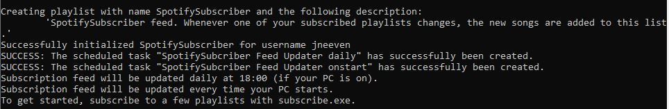
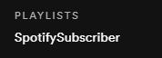
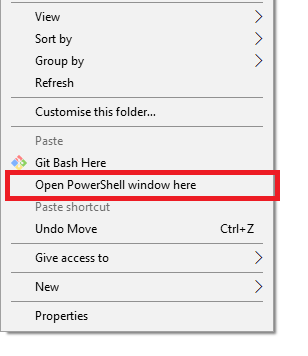

# Description
[WORK IN PROGRESS]

Spotify subscription feed tool. Allows you to subscribe to Spotify playlists, and creates a subscription feed playlist. Whenever any of the subscribed playlists changes, the new songs are added to the subscription feed. This is not only very convenient, but by keeping track of the songs that you delete from the subscription feed and those that end up in your library, the idea is to eventually train an AI that will automatically suggest new music to you.

The program can be either run from source using Python, or independently using a set of Windows executables (no additional installations required). See the sections below for instructions.

NOTE: There is no GUI yet, so all actions have to be performed using the command line. For the less technical users, detailed descriptions on how to do this have been provided in the next section. If you are familiar with Python, it is probably most convenient to just download and execute the source code directly, since you can then make changes if you desire. Instructions to do so are provided in the section [Running from source](#source_code).

This tool is in a very early stage, and all contributions are very welcome. Feel free to submit a pull request if you think something can be improved.

_If you are interested in receiving (additional) music suggestions or information on your listening behaviour, I suggest creating an account at https://www.last.fm/ and registering it with Spotify. Last.FM will track what songs you listen to and provide you with an overview of artists, tracks, genres, etc. It also creates a recommendation playlist you can listen to. I'm not too convinced by their recommendations, but their website provides a nice way to obtain listening data. I plan to develop a music recommendation AI in the future, and having this data is a nice starting point. If you would like to stay informed about this AI, follow my GitHub profile. Although it may use information obtained through SpotifySubscriber, I will probably publish it as a separate tool._


# Instructions
## <a name="windows_executables"></a> Using the Windows executables
### Downloading the tool and creating a subscription playlist
- Download [the zip file](https://github.com/jneeven/SpotifySubscriber/raw/master/SpotifySubscriber.zip) and extract it to the location you want to install the tool to.
- Open the extracted SpotifySubscriber folder.
- Execute `init.exe` as administrator (Administrator permissions are required to update the subscription feed whenever your PC starts up).
- After entering your Spotify username in the opened terminal, your browser will open and Spotify will ask you to login and give permission for this tool to read and modify your playlists, etc. After you give permission, you will be redirected to http://localhost/?code=SOME_CODE. **Do not close the browser window! Instead, copy the URL from the browser and enter it in the terminal window.** 
- If everything was successful, you should see something like this:




If you now open Spotify, you will see that a new playlist was added to your account:



This is the playlist to which all new tracks from your subscribed playlists will be added.

### Subscribe/Unsubscribe to playlists
To subscribe to a playlist, we have to use the PowerShell window. You can subscribe to any playlist you currently follow and do not own yourself (you can also subscribe to collaborative playlists you do own yourself, but the subscription feed won't show the tracks you added to this list yourself).

In the SpotifySubscriber folder, hold shift and press right click on an empty space in the folder,. You should see the option `"Open PowerShell window here"`:



Click this option, and in the window that appears, type the following command:
```bash
.\subscribe.exe "PART_OF_PLAYLIST_NAME"
```
This will subscribe you to all playlists that have this text in their name. For example 
```
.\subscribe.exe "release"
``` 
will subscribe to all Release Radar playlists you follow, as well as any other playlists of which the name contains "release".

To unsubscribe from a playlist, we simply add `--unsubscribe` like this:
```bash
.\subscribe.exe --unsubscribe "release"
```
Which will unsubscribe you from any playlists containing "release".


That's it! Your SpotifySubscriber feed will now be updated every day and every time your pc starts (as long as any of your subscribed playlists have changed). You can add or remove subscriptions any time. 


## <a name="source_code"></a> Running from source
Before running anything, you need to install the dependencies. SpotifySubscriber has only two: `numpy` and `spotipy`. Unfortunately, the version of `spotipy` provided by pip is outdated, so it needs to be installed from [source](https://github.com/plamere/spotipy).

To run the source code yourself, you first need to [register a new app in Spotify](https://developer.spotify.com/dashboard/applications).

After doing this, create a file called `client_data.json` in the src folder with the following structure:
```JSON
{
    "client_secret": "YOUR_CLIENT_SECRET",
    "client_id": "YOUR_CLIENT_ID"
}
```

To create a subscription feed, run the following command (**as administrator, if you are using Windows***):
```bash
python src/init.py
```
_*The administrator permissions are necessary to update your subscription feed every time your pc starts._

This will prompt you for your Spotify username, open your browser and prompt you to login to the Spotify access terminal. You will then be redirected to a page that cannot be reached (http://localhost/?code=SOME_CODE). **You must copy this URL into the terminal from which you executed the script!**
After entering the URL in the terminal, you should see a message like the following:
```
Successfully initialized SpotifySubscriber for username jneeven
SUCCESS: The scheduled task "SpotifySubcriber Feed Updater daily" has successfully been created.
SUCCESS: The scheduled task "SpotifySubcriber Feed Updater onstart" has successfully been created.
Subscription feed will be updated daily at 18:00 (if your PC is on).
Subscription feed will be updated every time your PC starts.
To get started, subscribe to a few playlists with subscribe.py.
```

If you are on Windows, the subscription feed will be updated automatically every day at 18:00 (if your pc is on) and every time your pc starts. If you are not on Windows, check section [Updating the feed (manually)](#updating_feed).

### Subscribing to and unsubscribing from playlists
After creating a subscription feed, you can subscribe to a playlist with the following command:
```bash
python src/subscribe.py "PART_OF_PLAYLIST_NAME"
```
Where `PART_OF_PLAYLIST_NAME` is the (part) of the playlist name you want to subscribe to. Note: you can only subscribe to playlist that you actually follow on Spotify. For example: 
```bash
python src/subscribe.py "release"
``` 
will subscribe to all followed playlists with 'release' in their name, for example the Release Radar.

To unsubscribe from a playlist, simply run the same command with the `--unsubscribe` option:
```bash
python src/subscribe.py --unsubscribe "PART_OF_PLAYLIST_NAME"
```

### <a name="updating_feed"></a> Updating the feed (manually)
To update the subscription feed (i.e. check for new tracks in your subscribed playlists) manually, simply run the following command:
```bash
python src/update.py
```

Since you don't want to have to do this manually every time, the init script has scheduled this to be done every time your pc starts and every day at 18:00 if you are on Windows. If you are not on Windows, you will want to schedule a task for this manually, for example using [crontab](https://vitux.com/scheduling-a-task-on-linux-using-crontab/) (Linux).


# Roadmap
There are many improvements that need to be made:
- The Windows executables should be tested on different devices.
- A GUI is necessary, because using three python scripts / executables is cumbersome.
- init.py should automatically schedule the task on Linux.
- Before adding new songs to the subscription feed, they should be compared to the feed history such that a song will never appear in the subscription feed twice. Currently, update_feed only filters duplicate tracks within the same update.
- Extending on the above, the feed could also filter songs that are already in any of the user's playlists or song library.
